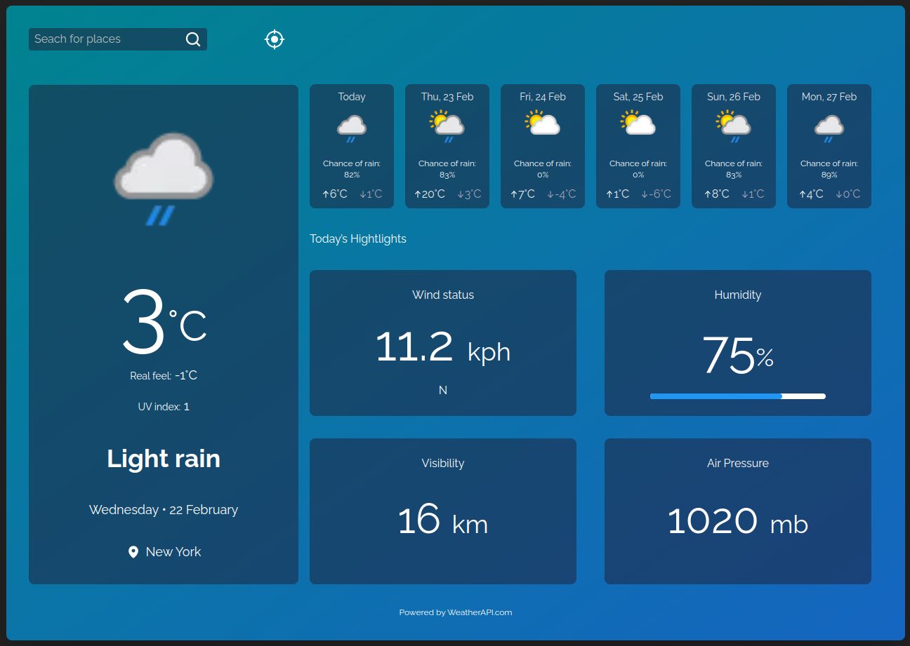

<p align="center">
  
  <br />
  ### WeatherApp
</p>

<p align="center">
  #### A simple app to show weather conditions 
  <br />
</p>

<p align="center">
  
  <br />
</p>

## Techs


## How To Use


To clone and run this application, you'll need Git and Node.js (which comes with npm) installed on your computer. From your command line:

```
# Clone this repository
$ git clone https://github.com/Jrm1992/WeatherApp.git

# Go into the repository
$ cd WeatherApp

# Install dependencies
$ npm install

# Run the app
$ npm run dev
```


## Autor

 <br />


Feito com ❤️ por Jose Roberto Marques 👋🏽 Entre em contato!

[](https://www.linkedin.com/in/jos%c3%a9-roberto-marques-de-s%c3%a1-62a57023b/)